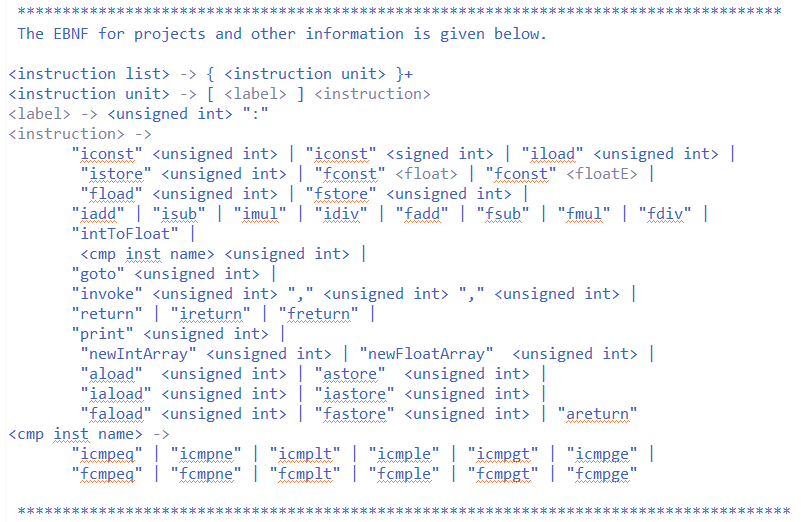

# VMarrays
A java virtual machine coded from scratch that supports integerArrays, floatArrays, integers and floats as data types. 

---  

 The objective of Project 4 is to build upon projects 3, 2, and 1.     
 
 Project 1 implemented a lexical analyzer for the input file based on state transitions 
 in a DFA that transitioned as each token was extracted.    
 
 Project 2 implemented a top-down parser to extract data from a file free of syntax errors.     
 The data was used to instantiate instructions and store them in an instruction store for our VM language.     

 Project 3 contains a runtime Stack that holds Frame Objects and an operand Stack 
 for Data items. Each Frame has an array of memory locations for parameters and
 needed variables plus the return address.     
 
 Project 4 implements two additional data types for the virtual machine: Integer Arrays
 and Float Arrays. These arrays extends the Data abstract class and are added to the 
 operandStack object. In addition, there are a new set of instructions added to the virtual 
 machine to enable array manipulation such as instantiate arrays, add and access values in
 the arrays, return an store array objects and other.        
 
 ---   
 
  *************************************************************************************    

 Please see javadoc for class Frame, LexVM, Data Objects, Instruction and others    
 for more virtual machine documentation and data used to implement the project 4..   

 *************************************************************************************    
 

 Some parameters for the program implementation:   
 
1. Implementation for the signed/unsigned integers is 32-bit int type, floating-point numbers is double-precision 64-bit double type.      

2. Labels may be any non-negative integers and may occur in any order in the instruction list.       
       They must, however, obey the following "semantic rules":      
	       a. No label may occur more than once in an instruction list.      
           b. The target label of each comparison-jump, goto, and invoke instruction must occur in the instruction list.    
           c. If these rules are violated, your program issues appropriate error messages.     

3. The labels used in the instruction list, including the target labels in comparison-jump, goto, and invoke instructions, are mapped to the corresponding indexes of the instruction array.     

---   

Below are extra details for the EBNF used by the virtual machine:   

   

---

**Running the program**   

This program requires input as command line arguments in order to run properly:        
   
  Pass a single number parameter 'x' such that (0 < x < 10) to run pre-loaded file 'x' with one argument version.   
				
**Otherwise**    
   
   argv[0] - must be a valid file name with input to be lexically analyzed, parsed and executed   
   argv[1] - a valid file name for the parsed output to be written to   
   argv[2] - OPTIONAL: a file with expected parsing output to be compared to generated output   
             for details, check the Javadocs for comapareOutput() in Stream.java    
             
 ****************************************************************************************************************    
 *WARNING: Using argv[2] checks for EXACT match and HALTS program when first space delimited mismatch is found    
 *****************************************************************************************************************     

